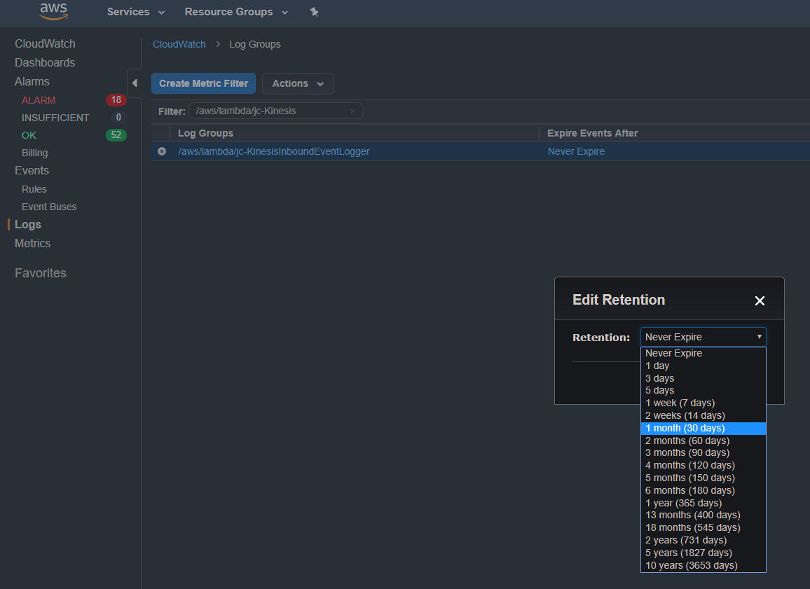

Our lambdas dump logs to [AWS CloudWatch](https://aws.amazon.com/cloudwatch/). By default, these logs exist indefinitely. However, there are ways to specify a duration for log retention.

## aws-cli

In addition to getting your aws-cli [set-up](https://docs.aws.amazon.com/cli/latest/userguide/cli-chap-getting-started.html), there are two values you'll need to acquire.

1. `log-group-name`: the name of the log group who's retention policy (retention time) you'd like to change. We'll use `/aws/lambda/KinesisInboundLogger` in our examples.
2. `retention-in-days`: the number of days you'd like to retain the logs in the specified log group for. There is a list of possible values available in the [aws logs documentation](https://docs.aws.amazon.com/cli/latest/reference/logs/put-retention-policy.html).

For example, if we wanted to set log retention to 30 days on our `KinesisInboundLogger` lambda, we would write:

```bash
aws logs put-retention-policy --log-group-name "/aws/lambda/KinesisInboundLogger" --retention-in-days 30
```

**Note:** The aws-cli log command that we're using is explained in detail [here](https://docs.aws.amazon.com/cli/latest/reference/logs/put-retention-policy.html).

## AWS Management Console

Changing the log retention policy in the AWS Management Console is a fairly simple process:

1. Navigate to the CloudWatch service in the AWS Management Console.
2. Click on the `Logs` entry on the sidebar.
3. Find the Log Group who's retention policy you're interested in changing.
4. Click on the value in the `Expire Events After` column.
5. Enter/Select the number of days you'd like to retain logs in that log group for.



## Terraform

There are optional variables that can be set during deployment of cumulus modules to configure
the retention period (in days) of cloudwatch log groups for lambdas and tasks. By setting the below 
variables in `terraform.tfvars` and deploying, the cloudwatch log groups will be instantiated or updated
with the new retention value. The variable are currently supported in these modules:

- `cumulus`
- `ingest` 
- `archive` 
- `data-migration`
- `distribution`
- `postgres-migration-async-operation`
- `postgres-migration-count-tool`
- `cumulus-distribution` 
- `hello_world_service`
- `python_test_ingest_processing_service`
- `python_processing_service`
- `provision_database`
- `data_persistence`
- `db_migration`
- `sqs_message_remover_lambda` 
- `tea_map_cache`

The variable `default_log_retention_days` can be configured in order to set the default log retention for all cloudwatch log groups in case a custom value isn't used. The log groups will use this value for their retention value, and if this value is not set either, the retention will default to 14 days.
For example, if a user would like their log_groups of one module to have a retention period of one year,
deploy the respective modules including:

### Example

```tf
default_log_retention_periods = 365
```

The retention period (in days) of cloudwatch log groups for specific lambdas and tasks can be set
during deployment using the `cloudwatch_log_retention_periods` terraform map variable. In order to
configure these values for respective cloudwatch log groups, declare the function's or task's name
(which will the cloudwatch log group's name after the respective prefix) within the map. Using the `DiscoverGranules` task and the `CustomBootstrap` lambda, an example would be:

### Example

```tf
cloudwatch_log_retention_periods = {
  DiscoverGranules = 365,
  CustomBootStrap = 90,
}
```

The retention periods must be a number included in this list: [0 1 3 5 7 14 30 60 90 120 150 180 365 400 545 731 1827 3653] (representing days), according to AWS CloudWatch terraform retention configuration.
