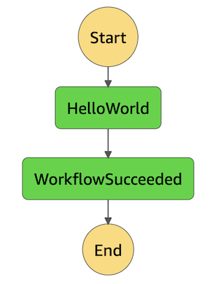

Example task meant to be a sanity check/introduction to the Cumulus workflows.

## Pre-Deployment Configuration

### Workflow Configuration

The [workflow definition](../workflows/README.md) can be found in `cumulus/example/workflows.yml` under `HelloWorldWorkflow:`

```yaml
HelloWorldWorkflow:
  Comment: 'Returns Hello World'
  StartAt: StartStatus
  States:
    StartStatus:
      Type: Task
      Resource: ${SfSnsReportLambdaFunction.Arn}
      CumulusConfig:
        cumulus_message:
          input: '{$}'
      Next: HelloWorld
    HelloWorld:
      CumulusConfig:
        buckets: '{$.meta.buckets}'
        provider: '{$.meta.provider}'
        collection: '{$.meta.collection}'
      Type: Task
      Resource: ${HelloWorldLambdaFunction.Arn}
      Next: StopStatus
    StopStatus:
      Type: Task
      Resource: ${SfSnsReportLambdaFunction.Arn}
      CumulusConfig:
        sfnEnd: true
        stack: '{$.meta.stack}'
        bucket: '{$.meta.buckets.internal.name}'
        stateMachine: '{$.cumulus_meta.state_machine}'
        executionName: '{$.cumulus_meta.execution_name}'
        cumulus_message:
          input: '{$}'
      Catch:
        - ErrorEquals:
          - States.ALL
          Next: WorkflowFailed
      End: true
    WorkflowFailed:
      Type: Fail
      Cause: 'Workflow failed'
```

Workflow **error-handling** can be configured as discussed in the [Error-Handling](error-handling.md) cookbook.

### Task Configuration

The HelloWorld [task itself](../workflows/developing-workflow-tasks.md) is defined in `cumulus/example/lambdas.yml` under `HelloWorld:`

```yaml
HelloWorld:
  handler: index.handler
  timeout: 300
  memory: 256
  source: 'node_modules/@cumulus/hello-world/dist/'
  useMessageAdapter: true
```

## Execution

We will focus on using the Cumulus dashboard to schedule the execution of a HelloWorld workflow.

Our goal here is to create a rule through the Cumulus dashboard that will define the scheduling and execution of our HelloWorld workflow. Let's navigate to the `Rules` page and click `Add a rule`.

```json
{
  "collection": {                  # collection values can be configured and found on the Collections page
    "name": "${collection_name}",
    "version": "${collection_version}"
  },
  "name": "helloworld_rule",
  "provider": "${provider}",       # found on the Providers page
  "rule": {
    "type": "onetime"
  },
  "state": "ENABLED",
  "workflow": "HelloWorldWorkflow" # This can be found on the Workflows page
}
```


*Executed workflow as seen in AWS Console*

### Output/Results

The `Executions` page presents a list of all executions, their status (running, failed, or completed), to which workflow the execution belongs, along with other information. The rule defined in the previous section should start an execution of its own accord, and the status of that execution can be tracked here.

To get some deeper information on the execution, click on the value in the `Name` column of your execution of interest. This should bring up a visual representation of the worklfow similar to that shown above, execution details, and a list of events.

## Summary

Setting up the HelloWorld workflow on the Cumulus dashboard is the tip of the iceberg, so to speak. The task and step-function need to be configured before Cumulus deployment. A compatible collection and provider must be configured and applied to the rule. Finally, workflow execution status can be viewed via the workflows tab on the dashboard.
