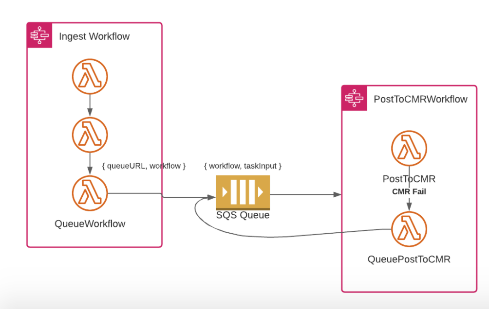

In this document, we will walktrough handling CMR errors in workflows by queueing PostToCmr. We will assume that the user already has an ingeset workflow setup.

1. Your ingest workflow will now end with the QueueWorkflow task.
2. You can specify a queue for that task, which will then start the workflow

## Overview

The general concept is that the last task of the ingest workflow will queue the publish workflow. When there is a CMR error from `PostToCmr`, the publish workflow will add itself back onto the queue so that it can be executed when CMR is back up. This is demonstrated in the following diagram


## Ingest Workflow

The last step should be the QueueWorkflow step. It should be configured with a queueUrl and workflow.

```
  "QueueWorkflowStep": {
    "Parameters": {
      "cma": {
        "event.$": "$",
        "ReplaceConfig": {
          "FullMessage": true
        },
        "task_config": {
          "internalBucket": "{$.meta.buckets.internal.name}",
          "stackName": "{$.meta.stack}",
          "workflow": "{$.meta.workflow}",
          "queueUrl": "${start_sf_queue_url}",
          "provider": "{$.meta.provider}",
          "collection": "{$.meta.collection}"
        }
      }
    },
    "Type": "Task",
    "Resource": "${queue_workflow_task_arn}",
    "Retry": [
      {
        "ErrorEquals": [
          "Lambda.ServiceException",
          "Lambda.AWSLambdaException",
          "Lambda.SdkClientException"
        ],
        "IntervalSeconds": 2,
        "MaxAttempts": 6,
        "BackoffRate": 2
      }
    ],
    "Catch": [
      {
        "ErrorEquals": [
          "States.ALL"
        ],
        "ResultPath": "$.exception",
        "Next": "WorkflowFailed"
      }
    ],
    "End": true
  },
```

## Publish Workflow

Configure the Catch section of your `PostToCmr` task to proceed to QueueWorkflow if a `CMRInternalError` is caught.


```
  "Catch": [
    {
      "ErrorEquals": [
        "CMRInternalError"
      ],
      "Next": "QueueWorkflow"
    },
    {
      "ErrorEquals": [
        "States.ALL"
      ],
      "Next": "WorkflowFailed",
      "ResultPath": "$.exception"
    }
  ],
```

You would then configure the QueueWorkflow task similarly to its configuration in the ingest workflow. The workflow will be the same as the current workflow, thereby requeuing itself when there is a CMR failure.
