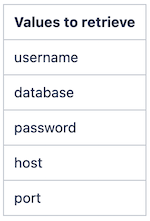
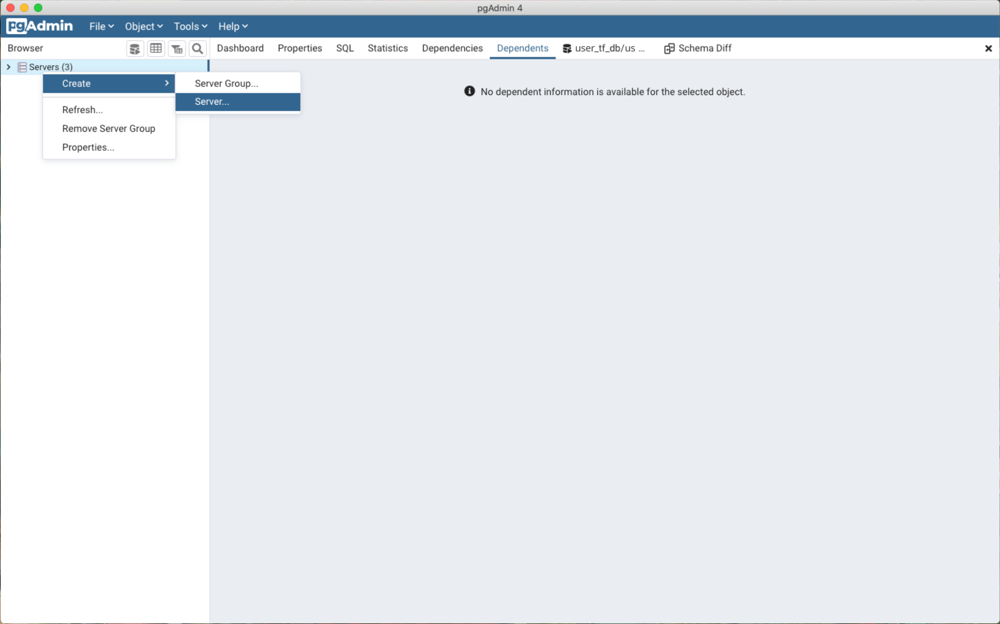
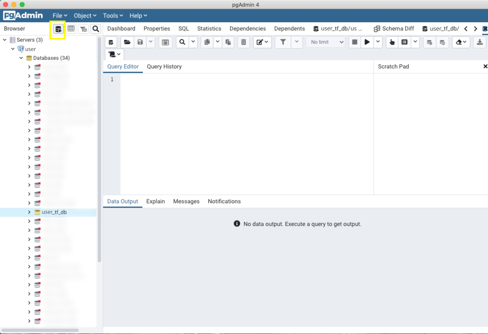

## Overview

Cumulus deployments require an Aurora [PostgreSQL 11](https://www.postgresql.org/) compatible database to be provided as the primary data store for Cumulus with Elasticsearch for non-authoritative querying/state data for the API and other applications that require more complex queries. Note that Cumulus is tested with an Aurora Postgres database.

Users are *strongly* encouraged to plan for and implement a database solution that scales to their use requirements, meets their security posture and maintenance needs and/or allows for multi-tenant cluster usage.

For some scenarios (such as single tenant, test deployments, infrequent ingest and the like) a properly
configured [Aurora Serverless](https://aws.amazon.com/rds/aurora/serverless/) cluster
*may* suffice.

To that end, Cumulus provides a terraform module
[`cumulus-rds-tf`](https://github.com/nasa/cumulus/tree/master/tf-modules/cumulus-rds-tf)
that will deploy an AWS RDS Aurora Serverless PostgreSQL 11 compatible [database cluster](https://aws.amazon.com/rds/aurora/postgresql-features/), and optionally provision a single deployment database with credentialed secrets for use with Cumulus.

We have provided an example terraform deployment using this module in the [Cumulus template-deploy repository](https://github.com/nasa/cumulus-template-deploy/tree/master/rds-cluster-tf) on GitHub.

Use of this example involves:

- Creating/configuring a [Terraform](https://www.terraform.io) module directory
- Using [Terraform](https://www.terraform.io) to deploy resources to AWS

---

## Requirements

Configuration/installation of this module requires the following:

- [Terraform](https://www.terraform.io)
- git
- A VPC configured for use with Cumulus Core.  This should match the subnets you provide when [Deploying Cumulus](./) to allow Core's lambdas to properly access the database.
- At least two subnets across multiple AZs.  These should match the subnets you provide as configuration when [Deploying Cumulus](./), and should be within the same VPC.

### Needed Git Repositories

- [Cumulus Deployment Template](https://github.com/nasa/cumulus-template-deploy)

### Assumptions

#### OS/Environment

The instructions in this module require Linux/MacOS.   While deployment via Windows is possible, it is unsupported.

#### Terraform

This document assumes knowledge of Terraform. If you are not comfortable
working with Terraform, the following links should bring you up to speed:

- [Introduction to Terraform](https://www.terraform.io/intro/index.html)
- [Getting Started with Terraform and AWS](https://learn.hashicorp.com/terraform/?track=getting-started#getting-started)
- [Terraform Configuration Language](https://www.terraform.io/docs/configuration/index.html)

For Cumulus specific instructions on installation of Terraform, refer to the main [Cumulus Installation Documentation](https://nasa.github.io/cumulus/docs/deployment/#install-terraform)

#### Aurora/RDS

This document also assumes some basic familiarity with PostgreSQL databases and Amazon Aurora/RDS.   If you're unfamiliar consider perusing the [AWS docs](https://aws.amazon.com/rds/aurora/) and the [Aurora Serverless V1 docs](https://docs.aws.amazon.com/AmazonRDS/latest/AuroraUserGuide/aurora-serverless.html).

## Prepare Deployment Repository

:::tip

 If you already are working with an existing repository that has a configured `rds-cluster-tf` deployment for the version of Cumulus you intend to deploy or update, *or*  you need to only configure this module for your repository, skip to [Prepare AWS Configuration](postgres_database_deployment#prepare-aws-configuration).

:::

Clone the [`cumulus-template-deploy`](https://github.com/nasa/cumulus-template-deploy) repo and name appropriately for your organization:

```bash
  git clone https://github.com/nasa/cumulus-template-deploy <repository-name>
```

We will return to [configuring this repo and using it for deployment below](#configure-and-deploy-the-module).

<details>
  <summary>Optional: Create a New Repository</summary>

  [Create a new repository](https://help.github.com/articles/creating-a-new-repository/) on GitHub so that you can add your workflows and other modules to source control:

```bash
  git remote set-url origin https://github.com/<org>/<repository-name>
  git push origin master
```

You can then [add/commit](https://help.github.com/articles/adding-a-file-to-a-repository-using-the-command-line/) changes as needed.

:::caution Update Your Gitignore File

If you are pushing your deployment code to a git repo, make sure to add `terraform.tf` and `terraform.tfvars` to `.gitignore`, **as these files will contain sensitive data related to your AWS account**.

:::

</details>

---

## Prepare AWS Configuration

To deploy this module, you need to make sure that you have the following steps from the [Cumulus deployment instructions](https://nasa.github.io/cumulus/docs/deployment/) in similar fashion *for this module*:

- [Set access keys](https://nasa.github.io/cumulus/docs/deployment/#set-access-keys)
- [Create the state bucket](https://nasa.github.io/cumulus/docs/deployment/#create-the-state-bucket)
- [Create the locks table](https://nasa.github.io/cumulus/docs/deployment/#create-the-locks-table)

---

### Configure and Deploy the Module

When configuring this module, please keep in mind that unlike Cumulus deployment, **this module should be deployed once** to create the database cluster and only thereafter to make changes to that configuration/upgrade/etc.

:::tip

This module does not need to be re-deployed for each Core update.

:::

These steps should be executed in the `rds-cluster-tf` directory of the template deploy repo that you previously cloned. Run the following to copy the example files:

```shell
cd rds-cluster-tf/
cp terraform.tf.example terraform.tf
cp terraform.tfvars.example terraform.tfvars
```

In `terraform.tf`, configure the remote state settings by substituting the appropriate values for:

- `bucket`
- `dynamodb_table`
- `PREFIX` (whatever prefix you've chosen for your deployment)

Fill in the appropriate values in `terraform.tfvars`. See the [rds-cluster-tf module variable definitions](https://github.com/nasa/cumulus/tree/master/tf-modules/cumulus-rds-tf) for more detail on all of the configuration options.  A few notable configuration options are documented in the next section.

#### Configuration Options

- `deletion_protection` -- defaults to `true`.   Set it to `false` if you want to be able to delete your *cluster* with a terraform destroy without manually updating the cluster.
- `db_admin_username` -- cluster database administration username.   Defaults to `postgres`.
- `db_admin_password` -- required variable that specifies the admin user password for the cluster.   To randomize this on each deployment, consider using a [`random_string`](https://registry.terraform.io/providers/hashicorp/random/latest/docs/resources/string) resource as input.
- `region` -- defaults to `us-east-1`.
- `subnets` -- requires at least 2 across different AZs.   For use with Cumulus, these AZs should match the values you configure for your `lambda_subnet_ids`.
- `max_capacity` -- the max ACUs the cluster is allowed to use.    Carefully consider cost/performance concerns when setting this value.
- `min_capacity` -- the minimum ACUs the cluster will scale to
- `provision_user_database` -- Optional flag to allow module to provision a user database in addition to creating the cluster.   Described in the [next section](#provision-user-and-user-database).

#### Provision User and User Database

If you wish for the module to provision a PostgreSQL database on your new cluster and provide a secret for access in the module output, *in addition to* managing the cluster itself, the following configuration keys are required:

- `provision_user_database` -- must be set to `true`. This configures the module to deploy a lambda that will create the user database, and update the provided configuration on deploy.
- `permissions_boundary_arn` -- the permissions boundary to use in creating the roles for access the provisioning lambda will need.  This should in most use cases be the same one used for Cumulus Core deployment.
- `rds_user_password` -- the value to set the user password to.
- `prefix` -- this value will be used to set a unique identifier for the `ProvisionDatabase` lambda, as well as name the provisioned user/database.

Once configured, the module will deploy the lambda and run it on each provision thus creating the configured database (if it does not exist), updating the user password (if that value has been changed), and updating the output user database secret.

Setting `provision_user_database` to false after provisioning will **not** result in removal of the configured database, as the lambda is non-destructive as configured in this module.

:::note

This functionality is limited in that it will only provision a single database/user and configure a basic database, and should not be used in scenarios where more complex configuration is required.

:::

#### Initialize Terraform

Run `terraform init`

You should see a similar output:

```shell
* provider.aws: version = "~> 2.32"

Terraform has been successfully initialized!
```

#### Deploy

Run `terraform apply` to deploy the resources.

:::caution

If re-applying this module, variables (e.g. `engine_version`, `snapshot_identifier` ) that force a recreation of the database cluster may result in data loss if deletion protection is disabled.  Examine the changeset **carefully** for resources that will be re-created/destroyed before applying.

:::

Review the changeset, and assuming it looks correct, type `yes` when prompted to confirm that you want to create all of the resources.

Assuming the operation is successful, you should see output similar to the following (this example omits the creation of a user's database, lambdas, and security groups):

<details>
  <summary>Output Example</summary>

```shell
terraform apply

An execution plan has been generated and is shown below.
Resource actions are indicated with the following symbols:
  + create

Terraform will perform the following actions:

  # module.rds_cluster.aws_db_subnet_group.default will be created
  + resource "aws_db_subnet_group" "default" {
      + arn         = (known after apply)
      + description = "Managed by Terraform"
      + id          = (known after apply)
      + name        = (known after apply)
      + name_prefix = "xxxxxxxxx"
      + subnet_ids  = [
          + "subnet-xxxxxxxxx",
          + "subnet-xxxxxxxxx",
        ]
      + tags        = {
          + "Deployment" = "xxxxxxxxx"
        }
    }

  # module.rds_cluster.aws_rds_cluster.cumulus will be created
  + resource "aws_rds_cluster" "cumulus" {
      + apply_immediately               = true
      + arn                             = (known after apply)
      + availability_zones              = (known after apply)
      + backup_retention_period         = 1
      + cluster_identifier              = "xxxxxxxxx"
      + cluster_identifier_prefix       = (known after apply)
      + cluster_members                 = (known after apply)
      + cluster_resource_id             = (known after apply)
      + copy_tags_to_snapshot           = false
      + database_name                   = "xxxxxxxxx"
      + db_cluster_parameter_group_name = (known after apply)
      + db_subnet_group_name            = (known after apply)
      + deletion_protection             = true
      + enable_http_endpoint            = true
      + endpoint                        = (known after apply)
      + engine                          = "aurora-postgresql"
      + engine_mode                     = "serverless"
      + engine_version                  = "10.12"
      + final_snapshot_identifier       = "xxxxxxxxx"
      + hosted_zone_id                  = (known after apply)
      + id                              = (known after apply)
      + kms_key_id                      = (known after apply)
      + master_password                 = (sensitive value)
      + master_username                 = "xxxxxxxxx"
      + port                            = (known after apply)
      + preferred_backup_window         = "07:00-09:00"
      + preferred_maintenance_window    = (known after apply)
      + reader_endpoint                 = (known after apply)
      + skip_final_snapshot             = false
      + storage_encrypted               = (known after apply)
      + tags                            = {
          + "Deployment" = "xxxxxxxxx"
        }
      + vpc_security_group_ids          = (known after apply)

      + scaling_configuration {
          + auto_pause               = true
          + max_capacity             = 4
          + min_capacity             = 2
          + seconds_until_auto_pause = 300
          + timeout_action           = "RollbackCapacityChange"
        }
    }

  # module.rds_cluster.aws_secretsmanager_secret.rds_login will be created
  + resource "aws_secretsmanager_secret" "rds_login" {
      + arn                     = (known after apply)
      + id                      = (known after apply)
      + name                    = (known after apply)
      + name_prefix             = "xxxxxxxxx"
      + policy                  = (known after apply)
      + recovery_window_in_days = 30
      + rotation_enabled        = (known after apply)
      + rotation_lambda_arn     = (known after apply)
      + tags                    = {
          + "Deployment" = "xxxxxxxxx"
        }

      + rotation_rules {
          + automatically_after_days = (known after apply)
        }
    }

  # module.rds_cluster.aws_secretsmanager_secret_version.rds_login will be created
  + resource "aws_secretsmanager_secret_version" "rds_login" {
      + arn            = (known after apply)
      + id             = (known after apply)
      + secret_id      = (known after apply)
      + secret_string  = (sensitive value)
      + version_id     = (known after apply)
      + version_stages = (known after apply)
    }

  # module.rds_cluster.aws_security_group.rds_cluster_access will be created
  + resource "aws_security_group" "rds_cluster_access" {
      + arn                    = (known after apply)
      + description            = "Managed by Terraform"
      + egress                 = (known after apply)
      + id                     = (known after apply)
      + ingress                = (known after apply)
      + name                   = (known after apply)
      + name_prefix            = "cumulus_rds_cluster_access_ingress"
      + owner_id               = (known after apply)
      + revoke_rules_on_delete = false
      + tags                   = {
          + "Deployment" = "xxxxxxxxx"
        }
      + vpc_id                 = "vpc-xxxxxxxxx"
    }

  # module.rds_cluster.aws_security_group_rule.rds_security_group_allow_PostgreSQL will be created
  + resource "aws_security_group_rule" "rds_security_group_allow_postgres" {
      + from_port                = 5432
      + id                       = (known after apply)
      + protocol                 = "tcp"
      + security_group_id        = (known after apply)
      + self                     = true
      + source_security_group_id = (known after apply)
      + to_port                  = 5432
      + type                     = "ingress"
    }

Plan: 6 to add, 0 to change, 0 to destroy.

Do you want to perform these actions?
  Terraform will perform the actions described above.
  Only 'yes' will be accepted to approve.

  Enter a value: yes

module.rds_cluster.aws_db_subnet_group.default: Creating...
module.rds_cluster.aws_security_group.rds_cluster_access: Creating...
module.rds_cluster.aws_secretsmanager_secret.rds_login: Creating...
```

Then, after the resources are created:

```shell
Apply complete! Resources: X added, 0 changed, 0 destroyed.
Releasing state lock. This may take a few moments...

Outputs:

admin_db_login_secret_arn = arn:aws:secretsmanager:us-east-1:xxxxxxxxx:secret:xxxxxxxxxx20210407182709367700000002-dpmdR
admin_db_login_secret_version = xxxxxxxxx
rds_endpoint = xxxxxxxxx.us-east-1.rds.amazonaws.com
security_group_id = xxxxxxxxx
user_credentials_secret_arn = arn:aws:secretsmanager:us-east-1:xxxxx:secret:xxxxxxxxxx20210407182709367700000002-dpmpXA
```

Note the output values for `admin_db_login_secret_arn` (and optionally `user_credentials_secret_arn`) as these provide the AWS Secrets Manager secrets required to access the database as the administrative user and, optionally, the user database credentials Cumulus requires as well.

The content of each of these secrets are in the form:

```json
{
  "database": "postgres",
  "dbClusterIdentifier": "clusterName",
  "engine": "postgres",
  "host": "xxx",
  "password": "defaultPassword",
  "port": 5432,
  "username": "xxx"
}
```

- `database` -- the PostgreSQL database used by the configured user
- `dbClusterIdentifier` -- the value set by the  `cluster_identifier` variable in the terraform module
- `engine` -- the Aurora/RDS database engine
- `host` -- the RDS service host for the database in the form (dbClusterIdentifier)-(AWS ID string).(region).rds.amazonaws.com
- `password` -- the database password
- `username` -- the account username
- `port` -- The database connection port, should always be 5432

</details>

---

### Connect to PostgreSQL DB via pgAdmin

If you would like to manage your PostgreSQL database in an GUI tool, you can via pgAdmin.

#### Requirements

- Download pgAdmin: [A management tool for PostgreSQL](https://www.pgadmin.org/)
- Installation of AWS CLI ([installation steps](https://docs.aws.amazon.com/cli/latest/userguide/getting-started-install.html))
- Installation of SSM AWS CLI plugin ([installation steps](https://docs.aws.amazon.com/systems-manager/latest/userguide/session-manager-working-with-install-plugin.html))

#### SSH Setup in AWS Secrets Manager

You will need to navigate to AWS Secrets Manager and retrieve the secret values for your database. The secret name will contain the string  `_db_login`  and your prefix. Click the  "Retrieve secret value" button ()to see the secret values.

The value for your secret name can also be retrieved from the `data-persistence-tf` directory with the command `terraform output`.



#### Setup ~/.ssh/config

Replace HOST value and PORT value with the values retrieved from Secrets Manager.

The LocalForward number 9202 can be any unused LocalForward number in your SSH config:

```shell
Host ssm-proxy 
  Hostname 127.0.0.1 
  User ec2-user
  LocalForward 9202 [HOST value]:[PORT value] 
  IdentityFile ~/.ssh/id_rsa
  Port 6868
```

#### Create a Local Port Forward

- Create a local port forward to the SSM box port 22, this creates a tunnel from `<local ssh port>` to the SSH port on the SSM host.

:::caution

`<local ssh port>` should not be `8000`.

:::

- Replace the following command values for `<instance id>` with your instance ID:

```shell
aws ssm start-session --target <instance id> --document-name AWS-StartPortForwardingSession --parameters portNumber=22,localPortNumber=6868
```

- Then, in another terminal tab, enter:

```shell
ssh ssm-proxy
```

#### Create PgAdmin Server

- Open pgAdmin and begin creating a new server (in newer versions it may be registering a new server).



- In the "Connection" tab, enter the values retrieved from Secrets Manager. Host name/address and Port should be the Hostname and LocalForward number from the ~/.ssh/config file.


:::note

Maintenance database corresponds to "database".

:::

You can select "Save Password?" to save your password. Click "Save" when you are finished. You should see your new server in pgAdmin.

#### Query Your Database

- In the "Browser" area find your database, navigate to the name, and click on it.

- Select the "Query Editor" to begin writing queries to your database.



You are all set to manage your queries in pgAdmin!

---

### Next Steps

Your database cluster has been created/updated! From here you can continue to add additional user accounts, databases, and other database configurations.
