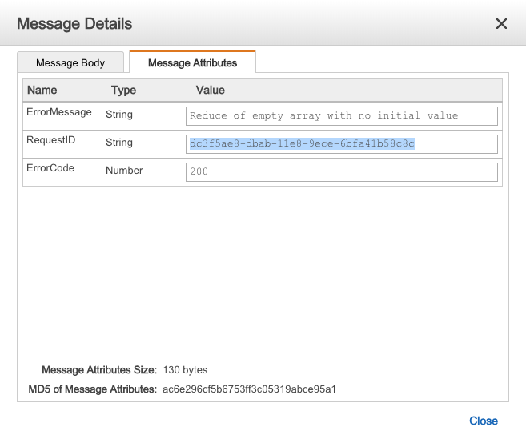

## startSF SQS queue

The [workflow-trigger](../workflows/workflow-triggers) for the startSF queue has a [Redrive Policy](https://docs.aws.amazon.com/AWSCloudFormation/latest/UserGuide/aws-properties-sqs-queues-redrivepolicy.html) set up that directs any failed attempts to pull from the workflow start queue to a SQS queue [Dead Letter Queue](https://docs.aws.amazon.com/AWSSimpleQueueService/latest/SQSDeveloperGuide/sqs-dead-letter-queues.html).

This queue can then be monitored for failures to initiate a workflow.   Please note that workflow failures will not show up in this queue, only repeated failure to trigger a workflow.

## Named Lambda Dead Letter Queues

Cumulus provides configured [Dead Letter Queues](https://docs.aws.amazon.com/AWSSimpleQueueService/latest/SQSDeveloperGuide/sqs-dead-letter-queues.html) (`DLQ`) for non-workflow Lambdas (such as ScheduleSF) to capture Lambda failures for further processing.

These DLQs are setup with the following configuration:

```hcl
  receive_wait_time_seconds  = 20
  message_retention_seconds  = 1209600
  visibility_timeout_seconds = 60
```

### **Default Lambda Configuration**

The following built-in Cumulus Lambdas are setup with DLQs to allow handling of process failures:

* dbIndexer (Updates Elasticsearch based on DynamoDB events)
* EmsIngestReport (Daily EMS ingest report generation Lambda)
* JobsLambda (writes logs outputs to Elasticsearch)
* ScheduleSF (the SF Scheduler Lambda that places messages on the queue that is used to start workflows, see [Workflow Triggers](../workflows/workflow-triggers.md))
* publishReports  (Lambda that publishes messages to the SNS topics for execution, granule and PDR reporting)
* reportGranules, reportExecutions, reportPdrs (Lambdas responsible for updating records based on messages in the queues published by publishReports)

## Troubleshooting/Utilizing messages in a [Dead Letter Queue](https://docs.aws.amazon.com/AWSSimpleQueueService/latest/SQSDeveloperGuide/sqs-dead-letter-queues.html)

Ideally an automated process should be configured to poll the queue and process messages off a dead letter queue.

For aid in manually troubleshooting, you can utilize the [SQS Management console](https://console.aws.amazon.com/sqs/home) to view/messages available in the queues setup for a particular stack.    The dead letter queues will have a Message Body containing the Lambda payload, as well as Message Attributes that reference both the error returned and a RequestID which can be cross referenced to the associated Lambda's CloudWatch logs for more information:


